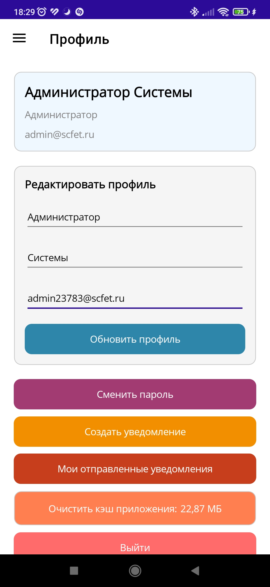
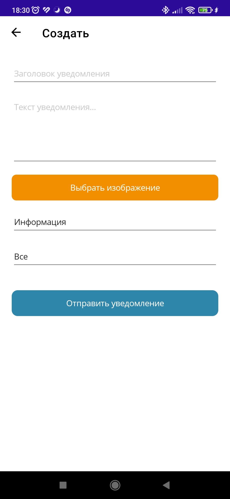
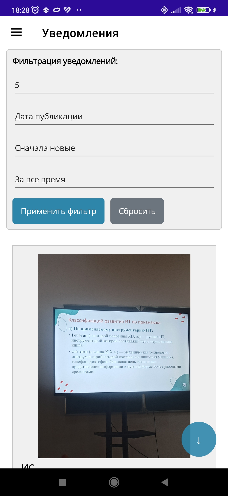
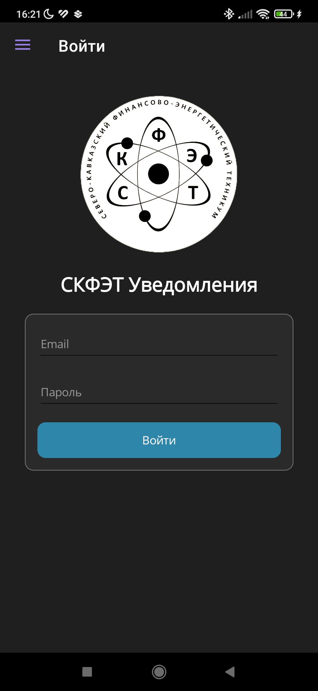

# SKFET Notification System 📢

  
  ### Мобильное приложение для оповещения студентов и сотрудников СКФЭТ
  
  
  
  
  
  

  
  

## 🎓 О проекте

**SKFET Notification System** — это мобильное приложение, разработанное для **Северо-Кавказского финансово-энергетического техникума (СКФЭТ)**. Система обеспечивает эффективное взаимодействие между администрацией, преподавателями и студентами через централизованную отправку уведомлений и объявлений.

> 📌 Проект создан в рамках учебной практики и реально используется (или планируется к использованию) в техникуме для оперативного оповещения участников образовательного процесса.

## 🏗 Архитектура системы
> Проект состоит из двух частей:
- **Backend** (отдельный репозиторий): ASP.NET Core Web API + SignalR + Entity Framework
- **Mobile Client** (этот репозиторий): .NET MAUI приложение для студентов, преподавателей и администраторов

## 👥 Ролевая модель

Система реализует гибкое разграничение прав доступа:

| Роль | Права |
|------|-------|
| **👨‍🎓 Студент** | • Просмотр входящих объявлений • Фильтрация по дате/отправителю • Просмотр деталей и изображений |
| **👨‍🏫 Учитель** | • Всё, что может студент • **Отправка объявлений:** учителям, студентам, группам студентов, конкретным студентам • Управление своими объявлениями |
| **👑 Администратор** | • Полный доступ к системе • **Отправка объявлений:** администраторам, учителям, студентам, группам, конкретным пользователям • Управление пользователями

## ✨ Ключевые возможности

### Для всех пользователей
- ✅ **Лента объявлений** — все уведомления в хронологическом порядке
- ✅ **Push-уведомления** — мгновенное оповещение о новых объявлениях (через SignalR)
- ✅ **Пагинация**

### Для отправителей (учителя/администраторы)
- ✅ **Создание объявлений** — с заголовком, текстом и изображением
- ✅ **Гибкая аудитория**:
- 📌 **Всем** — отправить всем пользователям системы
- 📌 **По ролям** — только студентам, только учителям или только админам
- 📌 **Группам** — выбрать конкретную учебную группу (например, "ИС-31")
- 📌 **Персонально** — отправить конкретному студенту, учителю или администратору
- ✅ **Прикрепление изображений** — загрузка из галереи
- ✅ **История отправок** — просмотр всех отправленных объявлений

### Технические особенности
- ✅ **Real-time уведомления** через SignalR — объявление приходит мгновенно
- ✅ **Авторизация и JWT** — безопасный вход в систему
- ✅ **Refresh Tokens** — Чтобы получать новые access-токены без повторной авторизации пользователя
- ✅ **MVVM архитектура** — чистое разделение логики и представления
- ✅ **Внедрение зависимостей (DI)** — гибкая и тестируемая архитектура

## 📸 Скриншоты

<table>
  <tr>
    <td></td>
  </tr>
  <tr>
    <td align="center">Экран Профиля</td>
  </tr>
</table>

<table>
  <tr>
    <td></td>
    <td></td>
    <td></td>
  </tr>
  <tr>
    <td align="center">Создание объявления</td>
    <td align="center">Лента объявлений</td>
    <td align="center">Экран входа</td>
  </tr>
</table>

## 🛠 Технологический стек

### Мобильное приложение
- **.NET MAUI** — кросс-платформенный фреймворк (Android, iOS)
- **C#** — основной язык разработки
- **CommunityToolkit.Mvvm** — реализация паттерна MVVM
- **Microsoft.Extensions.DependencyInjection** — DI контейнер
- **SignalR Client** — для real-time уведомлений
- **HttpClient** — взаимодействие с REST API
- **CommunityToolkit.Maui** — дополнительные контролы (MediaPicker для фото)

### Бэкенд (отдельный репозиторий)
- ASP.NET Core Web API
- Entity Framework Core (PostgreSql)
- SignalR Hub
- JWT Authentication, Resfresh Tokens
- Redis
- Kafka
- Docker
