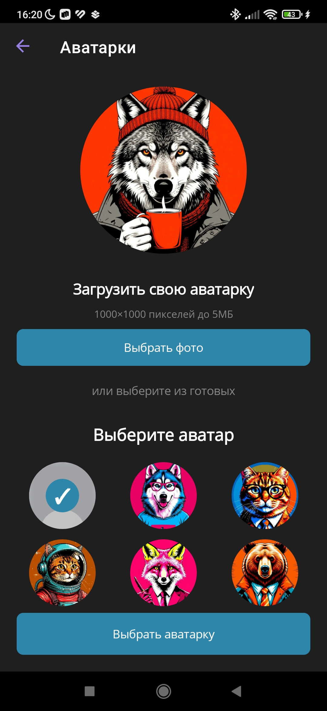
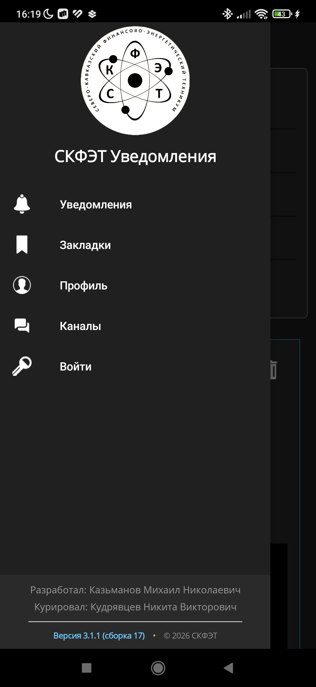
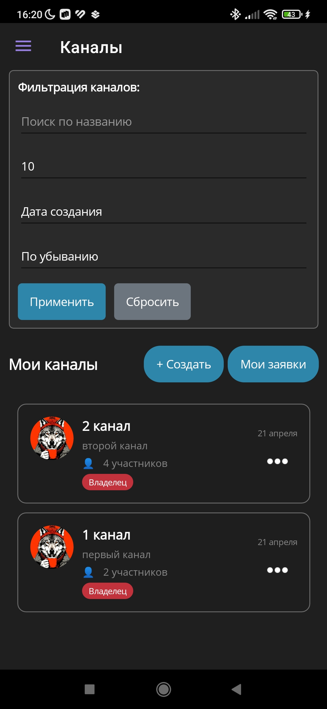
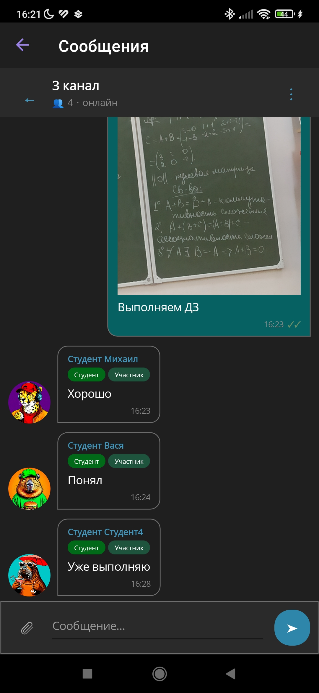
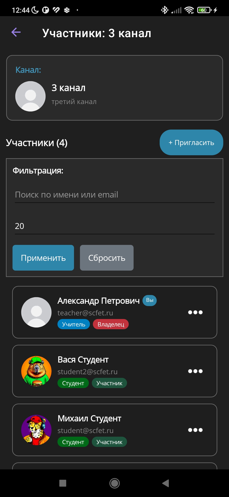
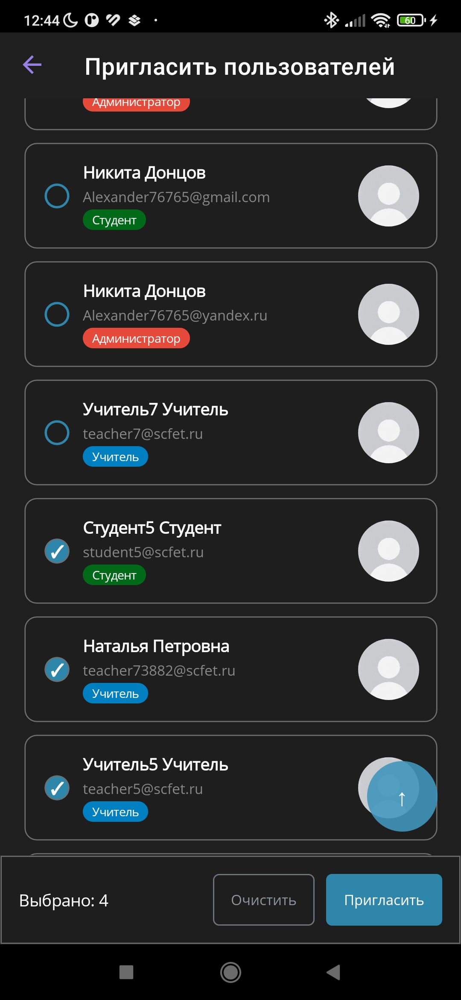
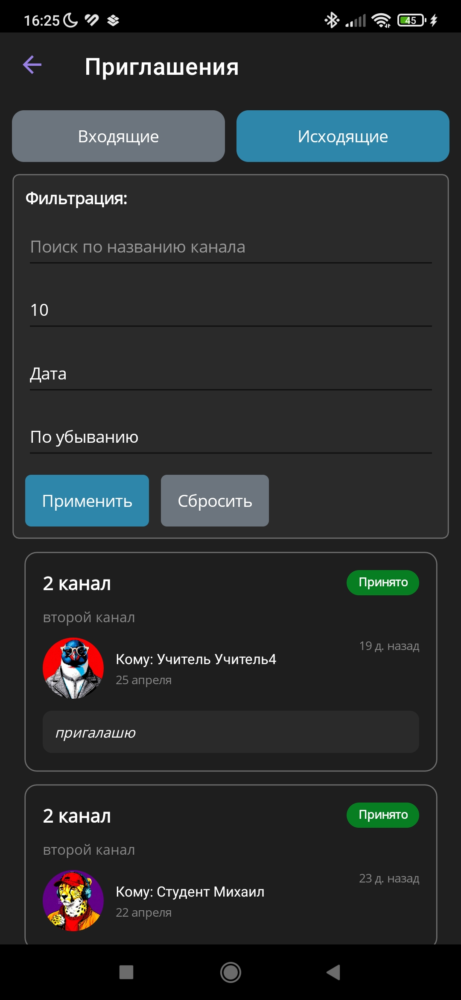
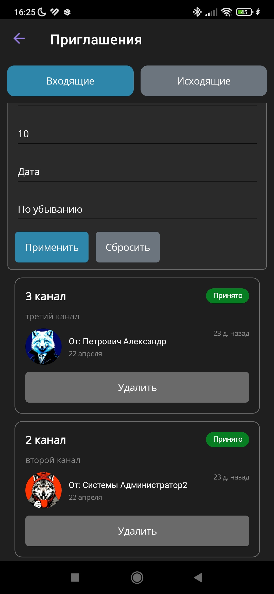
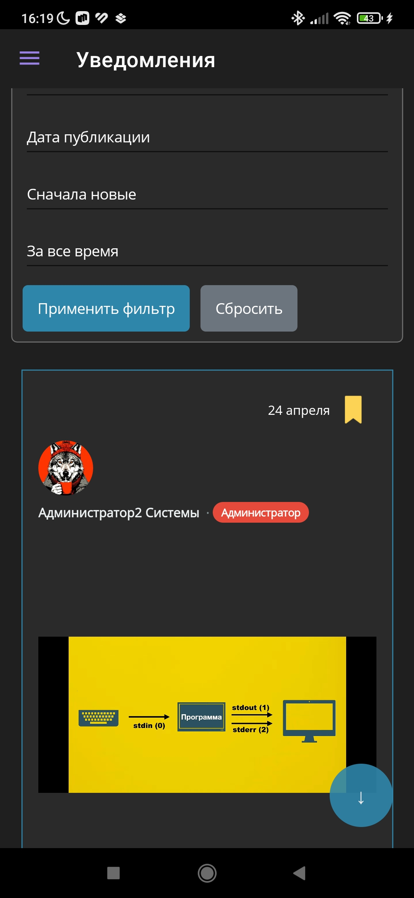
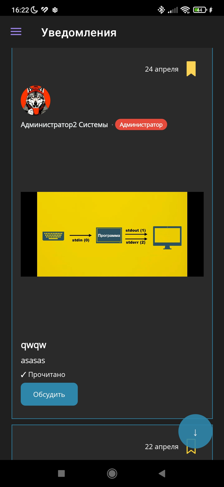

# SKFET Notification System 📢

  
  ### Мобильное приложение для оповещения и общения студентов и сотрудников СКФЭТ
  
  
  
  
  
  

  
  

## О проекте

**SKFET Notification System** — официальное мобильное приложение **Северо-Кавказского финансово-энергетического техникума** для связи между администрацией, преподавателями, студентами и родителями. Помимо централизованной системы оповещения, приложение включает полноценный мессенджер с каналами и чатами в реальном времени.

## Ролевая модель

Система поддерживает четыре роли с разграничением прав:

| Роль | Возможности |
|------|-------------|
| **Администратор** | Полный доступ к системе, модерация, все каналы и чаты |
| **Преподаватель** | Отправка объявлений, создание каналов, приглашение участников |
| **Студент** | Просмотр объявлений, участие в каналах и чатах |
| **Родитель** | Просмотр объявлений, ограниченное участие в каналах |

## Ключевые возможности

### Уведомления и объявления

- Лента объявлений с фильтрацией и пагинацией
- Создание объявлений с текстом и изображениями
- Гибкий выбор аудитории: всем, по ролям, группам, персонально
- Push-уведомления через SignalR — приходят мгновенно
- Избранное, обсуждения в комментариях
- История отправленных объявлений

### Мессенджер и каналы

- **Каналы** — создавайте тематические каналы для группового общения
- **Чат в реальном времени** — сообщения доставляются мгновенно через SignalR
- **Отправка изображений** — с предпросмотром и возможностью масштабирования
- **Ответы на сообщения** — цитируйте конкретное сообщение
- **Редактирование** — изменяйте свои сообщения после отправки
- **Статусы сообщений** — ✓ доставлено, ✓✓ прочитано
- **Индикатор печати** — показывает, когда собеседник набирает текст
- **Умная группировка** — сообщения группируются по датам и отправителям
- **Пагинация** — подгрузка истории при скролле вверх

### Управление участниками

- Приглашение пользователей с фильтрацией по ролям и группам
- Роли в канале: **Владелец → Администратор → Модератор → Участник**
- Изменение ролей и удаление участников
- Передача прав владельца другому участнику
- Приоритетная сортировка в списке участников

### Приглашения

- Вкладки «Входящие» и «Исходящие»
- Принять / отклонить / отменить в один клик
- Удаление обработанных приглашений
- Баннер с количеством новых приглашений на главном экране

### Профиль

- Настройка аватара из галереи или предустановленных вариантов
- Редактирование личных данных
- Смена пароля

### Безопасность

- JWT + Refresh Tokens — безопасная аутентификация
- Автоматическое обновление токена
- Разграничение прав на основе роли

## Скриншоты

<table>
  <tr>
    <td></td>
    <td></td>
    <td></td>
  </tr>
  <tr>
    <td></td>
    <td></td>
    <td></td>
  </tr>
  <tr>
    <td></td>
    <td></td>
    <td></td>
  </tr>
  <tr>
    <td></td>
    <td></td>
    <td></td>
  </tr>
</table>

## Архитектура приложения

### Паттерны и подходы

- **MVVM** — чёткое разделение логики и представления
- **Dependency Injection** — гибкая и тестируемая архитектура
- **Модульные API-сервисы** — разделение на `IAuthApiService`, `IChannelApiService`, `IChannelMessageApiService` и др.
- **Observer pattern** — реактивное обновление UI через SignalR события

### Ключевые компоненты

| Компонент | Назначение |
|-----------|-----------|
| `SignalRService` | Real-time подключение к NotificationHub и ChannelHub |
| `BaseApiService` | Общая логика HTTP-запросов и аутентификации |
| `AuthHandler` | Автоматическая подстановка JWT токена и обновление |
| `ChannelMessagesViewModel` | WhatsApp-подобный чат с группировкой и индикаторами |
| `PickImageService` | Кроссплатформенный выбор изображений|

## Технологический стек

### Мобильное приложение
- **.NET MAUI** — кросс-платформенный фреймворк
- **C# 12** — основной язык разработки
- **CommunityToolkit.Mvvm** — MVVM инструментарий (ObservableProperty, RelayCommand)
- **CommunityToolkit.Maui** — расширения MAUI (Popup, Behaviors)
- **Microsoft.Extensions.DependencyInjection** — DI контейнер
- **Microsoft.AspNetCore.SignalR.Client** — real-time коммуникация
- **System.Text.Json** — сериализация JSON
- **FFImageLoading** — оптимизированная загрузка изображений
- **Plugin.LocalNotification** — локальные уведомления

### Бэкенд (отдельный репозиторий)
- ASP.NET Core Web API
- Entity Framework Core (PostgreSQL)
- SignalR Hubs (NotificationHub, ChannelHub)
- JWT Authentication + Refresh Tokens
- Redis, Kafka, Docker
